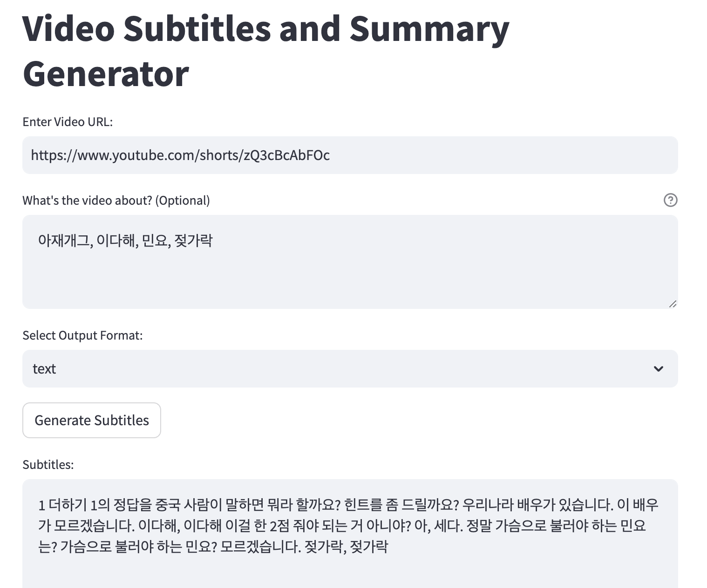

# Video Subtitles and Summary Generator

This Streamlit application generates subtitles for videos provided by the user and offers a summarization feature for the extracted text. Utilizing OpenAI's powerful models for transcription and summarization, this tool is designed to enhance accessibility and understanding of video content.

## Features

- **Video Subtitles Generation:** Extracts audio from video files and converts it into text, creating accurate subtitles.
- **Text Summarization:** Summarizes the generated subtitles into concise summaries, leveraging advanced natural language processing models.
- **Flexible Output Formats:** Supports various subtitle formats including plain text, SRT, and VTT.

## Installation

To run this application, you need Python 3.7 or later and pip installed on your system. Follow these steps:

1. Clone this repository to your local machine:

```bash
git clone https://github.com/ychoi-kr/vid2txt.git
cd your-repo-name
```

2. Install the required Python packages:

```bash
pip install -r requirements.txt
```

3. Obtain an API Key from OpenAI by signing up at [OpenAI](https://openai.com/).

4. Configure your OpenAI API Key:
    - Create a `.streamlit` folder in the root directory of your project if it doesn't already exist.
    - Inside the `.streamlit` folder, create a file named `secrets.toml`.
    - Add your OpenAI API Key to the `secrets.toml` file in the following format:
    
    ```toml
    [openai]
    OPENAI_API_KEY = "your_openai_api_key_here"
    ```
    
    Replace `your_openai_api_key_here` with your actual OpenAI API key.

5. Run the Streamlit application:

```bash
streamlit run streamlit_app.py
```

## Usage

1. **Enter Video URL:** Input the URL of the video you want to generate subtitles and summaries for.
2. **Describe the Video (Optional):** Provide a brief description or specific terms related to the video content to improve accuracy.
3. **Select Output Format:** Choose your preferred subtitle format.
4. **Generate Subtitles:** Click the button to extract and display subtitles.
5. **Summarize:** Once subtitles are generated, use this feature to get a concise summary.

## Demo



